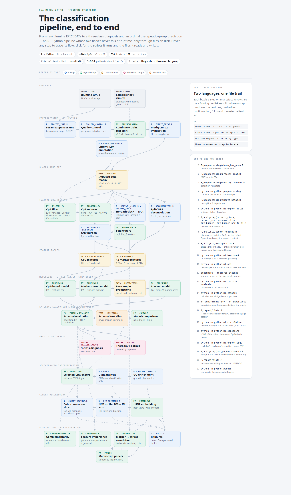

# DNA Methylation Profiling in Melanoma

This repository provides accompanies the paper:

**DNA Methylation Profiling in Melanoma: From Lesion Classification to Therapeutic Stratification**
*Winterstein, JT; Heinlein, L; et al.*

DNA-methylation pipeline for distinguishing invasive melanoma (IM), non-invasive melanoma (NIM),
and benign melanocytic nevi (NV) from Illumina EPIC v1 / EPIC v2 arrays, plus therapeutic group prediction.

The repo has two halves:

- **R** — IDAT → beta-value preprocessing, quality control, imputation, and per-sample epigenetic
  marker computation (Horvath clock, EpiSCORE cell-type deconvolution, CNV burden).
- **Python** — feature engineering, the unified ML benchmark (3-class diagnosis classification +
  therapeutic group ordinal regression), stacking, evaluation, and figure generation.

The two sides exchange files on disk through paths declared in `config.yaml` — there is no Python
↔ R runtime coupling.

[](docs/pipeline.html)

The image is a snapshot of [`docs/pipeline.html`](docs/pipeline.html) — **open that file in a browser** for the
interactive version: hover a step to trace its flow, click it for the scripts it runs and the files it reads and
writes, filter by step type, hover a run-order entry to locate it in the graph.

---

## Layout

```
config.yaml          # Single source of truth for all paths and shared settings
data/                # Manifests, sample sheets, intermediate betas (gitignored)
results/             # Per-analysis output dirs. classifier/ is split into
                     #   models/ cv/ predictions/ importance/ complementarity/ comparison/
plots/               # Generated figures, one subdir per analysis
docs/                # pipeline.html (interactive pipeline map) + pipeline_map.png (its snapshot, shown above)
apptainer/           # r.def / python.def container definitions + build.sh

R/
  preprocessing/     # process_idat.R, quality_control.R, impute_betas.R, chrom_hmm_anno.R
  analysis/          # horvath_clock.R, horvath_eaa.R, deconvolution.R, cnv_burden.R,
                     #   cnv_burden_per_fold.R, cohort_heatmap.R, nim_spectrum.R, dmr.R, go_enrichment.R
  report/            # plots.R
  lib/               # utils.R, cnv_helpers.R, plot_utils.R

python/
  config.py          # YAML loader; exposes _cfg_path(key) and shared constants
  preprocessing.py   # Sample-sheet cleanup, train/test split bookkeeping
  visualization.py   # Shared plotting helpers (ROC, confusion, etc.)
  panels.py          # Composites the individual plots into the multi-panel manuscript figures
  helper/            # Standalone utilities: create_panel_promoters.py, cv_results_to_xlsx.py,
                     #   manuscript_metadata.py
  ml/
    benchmark.py     # Unified CV CLI over (task × feature source × filter × reducer × model)
    correlation.py   # Marker-vs-target correlation analysis (both tasks)
    embedding.py     # t-SNE embedding of the CpG samples (both tasks, heatmap CpGs or all)
    cv.py            # Task-agnostic CV loop
    tasks.py         # Task definitions (classification, ordinal) + their metric sets
    ajcc.py          # Canonical AJCC stage → therapeutic group (0-5) mapping
    features/        # CpG / markers / stacked feature sources
    filters.py       # CpG pre-selection (IQR, variance, Boruta, elasticnet, ChromHMM, …)
    reducers.py      # PCA / PLS / autoencoder / ChromHMM aggregation
    _registries.py   # FILTERS / REDUCERS registries + CLI-name → component resolution
    models/          # Classification + ordinal model registries
    _utils.py        # Small shared helpers (device resolution, …)
    oof.py           # Out-of-fold prediction export (used by stacking)
    export_folds.py  # Writes cv_folds__{task}.csv consumed by the R per-fold CNV/EAA steps
    export_cpgs.py   # Writes selected_cpgs__* per CpG checkpoint, consumed by the R DMR/GO analyses
    train.py         # Fit a single pipeline on the full training set
    evaluate.py      # External-test-set evaluation of a trained artefact
    importance.py    # Permutation importance for markers/stacked models
    complementarity.py # CpG↔markers base-learner complementarity (per-sample rescue counts)
    stats.py         # Statistical tests (paired-bootstrap AUROC/MAE, DeLong, Kruskal-Wallis, Holm correction)
    compare.py       # Pairwise model-vs-model significance testing on the test split
```

---

## Installation

Two supported routes: the **Apptainer images**, which pin both stacks and are what the cluster jobs run, or a
**native install** of each half.

### Option A — Apptainer images

Two single-purpose images, one per language half, defined in [`apptainer/`](apptainer/):

| Image        | Definition   | Contents                                                                                              |
|--------------|--------------|-------------------------------------------------------------------------------------------------------|
| `r.sif`      | `r.def`      | R 4.6 / Bioconductor 3.23: `sesame`, `methyLImp2`, `DMRcate`, `conumee2`, `EpiSCORE`, `methylclock`, … |
| `python.sif` | `python.def` | Python 3.14, installed `--frozen` from `python/uv.lock`: `torch`, `xgboost`, `scikit-learn`, …         |

```bash
./apptainer/build.sh            # both images (needs --fakeroot)
./apptainer/build.sh r          # or just one
./apptainer/build.sh python
```

The images land in `apptainer/*.sif` and are gitignored. `python.sif` is multi-GB because `torch` resolves to the
CUDA build on Linux.

Running a step means binding the repo and starting in the working directory that half expects — `R/` for the R
scripts (`R/lib/utils.R` reads `../config.yaml`), the repo root for Python (the whole tree is one `python.*`
package):

```bash
# R step
apptainer exec --bind "$PWD:$PWD" --pwd "$PWD/R" apptainer/r.sif \
    Rscript analysis/deconvolution.R

# Python module
apptainer exec --bind "$PWD:$PWD" --pwd "$PWD" apptainer/python.sif \
    python -m python.ml.benchmark --task classification --features markers
```

- **Data outside the repo** needs its own bind — the IDAT mounts (`paths.idat_v1_dir` / `_v2_dir`) are absolute:
  `--bind /mnt/data/SCPMethyl:/mnt/data/SCPMethyl`.
- **GPU** (the neural reducers/models): request one from the scheduler and add `--nv`.
- **sesame annotation data** is downloaded on first use, so populate the cache once from a machine with network
  access.

  ```bash
  apptainer exec apptainer/r.sif Rscript -e 'sesameData::sesameDataCacheAll()'
  ```

### Option B — native install

**Python** — [`uv`](https://docs.astral.sh/uv/) manages the environment; it installs the locked interpreter too, so
no system Python 3.14 is required:

```bash
curl -LsSf https://astral.sh/uv/install.sh | sh   # if uv is not installed
cd python
uv sync                  # python/.venv from pyproject.toml + uv.lock
```

Then run every module from the **repository root** with that venv active, as `python -m python.ml.<script>`.

**R** — R 4.6 with Bioconductor 3.23. The `%post` block of `apptainer/r.def` is the authoritative package list;
it installs CRAN (`data.table`, `ggplot2`, `ggpubr`, `reshape2`, `rstatix`, `yaml`, `pheatmap`),
Bioconductor (`BiocParallel`, `sesame`, `sesameData`, `methyLImp2`, `DMRcate`, `methylclock`, `missMethyl`,
`ChIPseeker`, `rtracklayer` plus the `TxDb.Hsapiens.UCSC.hg38.knownGene`, `org.Hs.eg.db` and
`IlluminaHumanMethylationEPICanno.ilm10b4.hg19` annotations) and three GitHub-only packages
(`hovestadtlab/conumee2` from its `conumee2` subdirectory, `immunogenomics/presto`, `aet21/EpiSCORE` — presto is a
hard dependency of EpiSCORE, so install it first). Run the scripts from the `R/` directory.

---

## Configuration

Everything is driven by `config.yaml` at the repo root:

- `paths.*` — input/intermediate/consumed-file paths plus the two output roots `results` and
  `plots` (relative to the repo root unless absolute, e.g. the IDAT mount points). Both R
  (`R/lib/utils.R::path()`) and Python (`python/config.py::_cfg_path()`) resolve paths through
  this file, so editing it is enough to relocate data. Per-analysis output **sub**directories are
  not keys — they are derived from the roots in code (constants in `python/config.py`, the
  `results_dir()` / `plots_dir()` helpers in `R/lib/utils.R`).
- `test_clinic` — the clinic held out entirely as the external test set.
- `random_state`, `workers` — shared seed and parallelism budget.
- `colors.*` — palette for plots (diagnosis classes, therapeutic groups, cell types).
- `figure.*` — shared figure style (font stack, point sizes, line width) and the `panel_mm` column widths
  every figure is drawn at, honoured by both `python/visualization.py` and `R/lib/plot_utils.R` so panels from
  either language assemble without rescaling.
- `thresholds.*` — cutoffs shared by a compute script and the report that plots its output (DMR
  significance/effect size, GO FDR), so a figure label can never disagree with the filter behind it.
  Parameters used by only one script stay in that script.

---

## R pipeline

Run from the `R/` directory (so `source("lib/utils.R")` resolves and the relative `../config.yaml` paths hold),
with the stack from [Installation](#installation) — `r.sif` or a local R 4.6 / Bioconductor 3.23.

### Preprocessing — `R/preprocessing/`

1. **`process_idat.R`** — reads raw IDATs from `paths.idat_v1_dir` / `paths.idat_v2_dir`,
   computes beta values per slide with `sesame::openSesame(prep = "QCDPB")`, writes per-batch
   CSVs into `paths.epic_v1_dir` / `paths.epic_v2_dir`.
2. **`quality_control.R`** — per-probe detection-rate stats; outputs
   `paths.epicv1_detectionrate`, `paths.epicv2_detectionrate`.
3. **`impute_betas.R`** — `methyLImp2` imputation on the train/test splits produced by Python
   (`paths.betas_train`, `paths.betas_test`) → `paths.betas_imputed_train/test`.
4. **`chrom_hmm_anno.R`** — overlaps both  EPIC manifests with the Roadmap E059 (primary foreskin melanocytes) 15-state 
   ChromHMM segmentation → `paths.chrom_hmm` (v1) and `paths.chrom_hmm_v2`, the lookup behind the `chrom_hmm_*` filters 
   and the ChromHMM reducer in `python/ml/`. The segmentation BED (`paths.chrom_hmm_segments`) is available
   [here](https://egg2.wustl.edu/roadmap/data/byFileType/chromhmmSegmentations/ChmmModels/coreMarks/jointModel/final/).

### Marker computation — `R/analysis/`

- **`horvath_clock.R`** — epigenetic age (Horvath 2013) per array version, written to
  `paths.horvath_ages_v1/v2`. Drives the EAA marker.
- **`horvath_eaa.R`** — leakage-safe epigenetic age acceleration (residual of `skinHorvath ~ age` fit on
  training rows only), one file per task → `paths.horvath_eaa_classification/ordinal`.
- **`deconvolution.R`** — EpiSCORE cell-type fractions (broad + immune references) → 
  `paths.deconv_episcore`.
- **`cnv_burden.R`** — sesame-based CNV burden using all non-test-clinic nevi as the reference.
  Outputs `results/cnv_burden/cnv_burden_results.csv`.
- **`cnv_burden_per_fold.R`** — same, but rebuilds the nevus reference from each training fold
  only (reads `cv_folds__classification.csv` exported by `python/ml/export_folds.py`); writes
  `cnv_burden_results_fold{k}.csv`. Prevents validation samples from peeking at their own
  reference.

### Cohort overview — `R/analysis/`

- **`cohort_heatmap.R`** — beta slice for the cohort heatmap: the 500 CpGs most associated with the three diagnoses
  by Kruskal-Wallis → `results/cohort/classification_cpgs_betas.csv`, plus `classification_cpgs_stats.csv` (H, p, η², group means).
  Ranking runs on the **training split**; the slice covers the **whole cohort**, which is what the figure describes. 
  Compute-only; `R/report/plots.R` draws the figure.
- **`nim_spectrum.R`** — where NIM sits between NV and IM: the 10 000 CpGs per direction whose mean β shifts most from
  nevus to invasive melanoma define a lost- and a gained-methylation set, and each lesion is summarised as its mean β
  over each set → `results/nim_spectrum/axis_mean_betas.csv` plus `axis_pairwise_tests.csv` (Wilcoxon rank-sum, Holm).
  NIM never enters the CpG selection, so NV vs NIM and NIM vs IM are out-of-sample; NV vs IM is deliberately not
  tested, since the axis CpGs were picked to maximise exactly that difference. The axis is fitted over the **whole
  cohort** — it is a descriptive contrast, and the groups it is fitted on are not the ones tested.
  Compute-only; `R/report/plots.R` draws the two violin panels, annotating each with the adjusted p-values from that
  second table rather than recomputing them.

### Selected-CpG interpretation — `R/analysis/`

Both read the selection designated per task by `paths.selected_cpgs_classification` / `_ordinal` (one of the
exports from `ml.export_cpgs`) and bridge genome coordinates to EPIC probe IDs via `paths.cpg_position_mapping`, since 
the Bioconductor annotation is probe-ID based. They interpret the model's features. To interpret a different pipeline,
repoint the config key; the R scripts are agnostic to which filter/reducer produced the selection.

Both are **compute-only**: they write tables to `results/`, and `R/report/plots.R` draws every figure from
those tables. Adjusting a figure doesn't need to re-run the analysis. The thresholds the figures label themselves 
with live in `config.yaml` (`thresholds.dmr_fdr`, `thresholds.dmr_delta`, `thresholds.go_fdr`).

- **`dmr.R`** — DMRcate over the three diagnosis contrasts (IM/NIM/NV), filtered
  to significant (HMFDR < `dmr_fdr`) and high-effect (|Δβ| ≥ `dmr_delta`) regions, then intersected with the
  selected CpGs: do the classifier's CpGs sit in regionally differential biology? Classification-only — the
  contrasts are diagnosis pairs. The contrasts run over the **whole cohort** (train+test): this is a descriptive
  analysis, so holding samples back would only cost power; the selection they are intersected with is still the one
  derived on the training split alone. Writes `dmr_summary.csv`, `dmr_regions.csv` (every region, for the volcano),
  `selected_cpgs_in_dmrs.csv`, plus `selected_cpgs_betas.csv`, whose only purpose is to feed the report.
- **`go_enrichment.R`** — nearest-gene annotation (ChIPseeker, hg38, promoter window TSS-1500..+200) plus
  `missMethyl::gometh` GO enrichment against the array background, which corrects for CpGs-per-gene bias.
  Runs **both** tasks in one go → `results/go/<task>/`. Its one figure is `plots/go/<task>/gometh_bias.pdf`: `gometh`
  draws the diagnostic as a side effect of the enrichment call itself.

### Reporting — `R/report/`

- **`plots.R`** — every R figure, drawn from persisted tables: QC probe-detection histogram, deconvolution stacked bar,
  the Horvath chronological-vs-predicted age scatter, the cohort heatmap (every sample over the diagnosis-associated
  CpGs, blocked IM | NIM | NV and annotated with diagnosis, therapeutic group, age, hospital and EPIC array
  generation), the two NV → IM axis violins, the three DMR figures (count bar, volcano, beta heatmap) and the per-task GO term
  bar chart. Each section skips itself with a message if its compute step
  hasn't run. The diagnosis-grouped marker boxplots and group tests (Kruskal–Wallis / pairwise) live in 
  `python/ml/correlation.py`, the single source for that analysis.

---

## Python pipeline

Run any module as `python -m python.ml.<script>` from the **repository root** (with the `python/.venv` active, or
inside `python.sif` — see [Installation](#installation)). The whole `python/` tree is one package, imported as `python.*`.

### Data prep — `python/preprocessing.py`

Cleans the sample sheet, joins meta + sentrix mapping, and writes
`paths.methylation_samples_cleaned` and the train/test beta splits.

### Unified ML — `python/ml/`

The CV body in `cv.py` is **task-agnostic**: everything that differs between the 3-class
diagnosis problem and the therapeutic group ordinal problem lives on the `Task` object in `tasks.py`
(stratification, metric functions, OOF schema, sklearn predict method). The CV body in turn
runs over any `FeatureSource`:

- **`features/cpg.py`** — raw EPIC betas (~644k columns after the v1 ∩ v2 join); supports the full filter → reducer
  pipeline.
- **`features/markers.py`** — 12 CpG-derived markers (Horvath EAA, EpiSCORE fractions, CNV
  burden). `prepare_fold` swaps in the per-fold CNV file and out-of-fold Horvath EAA so val rows
  never see their own reference.
- **`features/stacked.py`** — meta features = the CpG model's prediction columns ⨁ the marker
  model's; both artefact paths are CLI arguments, and the schema (`prob_*` vs single `prediction`)
  is auto-detected so stacking works for both tasks.

#### Benchmark CLI — `ml/benchmark.py`

The single entry point for the (task × feature source × filter × reducer × model) sweep:

```bash
# 3-class diagnosis benchmark over raw CpGs, all filters/reducers/models
python -m python.ml.benchmark --task classification --features cpg

# Therapeutic group ordinal regression over the marker feature set
python -m python.ml.benchmark --task ordinal --features markers --no-upsample

# Stacked meta-classifier on top of the two base learners' OOF artefacts
python -m python.ml.benchmark --task classification --features stacked \
    --cpg-oof results/classifier/cv/oof_predictions__classification__cpg__boruta__none__svm.csv \
    --marker-oof results/classifier/cv/oof_predictions__classification__markers__none__none__random_forest.csv
```

`--filters`, `--reducers`, `--models` accept subsets of their respective registries
(see `FILTERS`/`REDUCERS` in `ml/_registries.py` and `MODELS` in `ml/models/__init__.py`).
Filter and reducer flags are ignored for non-CpG feature sources.

#### Other ML scripts

- **`ml.export_folds`** — writes `cv_folds__{task}.csv` (5-fold patient-stratified `StratifiedGroupKFold`,
  one file per task) so the R fold-aware steps — per-fold CNV and out-of-fold Horvath EAA — match
  Python's exact splits.
- **`ml.export_cpgs`** — pulls `selected_cpgs` out of the trained raw-CpG checkpoints so the R DMR/GO analyses
  can read a selection without unpickling a Python artefact. Sweeps every (task × filter × reducer × model)
  CpG checkpoint by default, one CSV per artefact named after it
  (`selected_cpgs__<task>__cpg__<filter>__<reducer>__<model>.csv`); `--task`/`--filter`/`--reducer`/`--model`
  narrow the sweep and `--artifact` targets one file directly. Markers/stacked artefacts are excluded — their
  `selected_cpgs` holds feature names, not CpGs. Which of the exports the R analyses interpret is set by
  `paths.selected_cpgs_classification` / `_ordinal`.
- **`ml.oof`** — generates the OOF prediction file consumed by `features/stacked.py` and by
  `ml.complementarity`.
- **`ml.train`** — fits a single (filter, reducer, model) pipeline on the full training set
  and pickles the artefact (filter mask + fitted reducer + estimator).
- **`ml.evaluate`** — applies a trained artefact to the external test split; task-aware
  (branches on the `task` stamped by `ml.train`), emitting the task's headline metrics with
  bootstrap CIs and task-appropriate plots (e.g. ROC / confusion matrix for classification).
- **`ml.complementarity`** — CpG↔markers complementarity on top of per-sample prediction files
  (OOF or external-test predictions): a sample-level (CpG correct?) × (markers correct?)
  contingency table and per-class rescue rates, diffing a CpG and a markers prediction file
  (task-agnostic). Descriptive only — whether the two learners *differ* is tested upstream by
  `ml.compare` on the primary endpoint (AUROC / MAE); this shows *where* they differ. Writes to
  `results/classifier/complementarity/`.
- **`ml.importance`** — feature importance for the low-dim feature sources (markers, stacked):
  per-feature and grouped permutation importance on a trained artefact's named input columns,
  task-aware for classification and ordinal. Rebuilds the artefact's feature source like
  `ml.evaluate` and scores on the external test split. Raw-CpG models are not handled.
- **`ml.compare`** — pairwise model-vs-model significance testing on the external test split,
  answering what overlapping per-model CIs cannot: whether two models actually differ. Compares the
  models trained on different feature sources (cpg vs markers vs stacked), aligning their
  `test_predictions__*.csv` files by `slideId` and running a *paired* test per pair — a paired
  difference bootstrap on macro-OvR AUROC plus DeLong's test on each per-class one-vs-rest AUROC
  (classification), or a paired difference bootstrap on macro-averaged MAE (ordinal) — with
  Holm-Bonferroni correction across each metric family. Writes a table to
  `results/classifier/comparison/` and a Δ forest plot per metric. Run as
  `python -m python.ml.compare --task classification|ordinal`.
  The tests live in **`ml.stats`** (the project's home for hypothesis tests, delegating to
  scipy/statsmodels/MLstatkit).

### Other Python entry points

- **`ml.correlation`** — marker ↔ target correlation analysis, separate from the ML predictor and run for
  **both** tasks on the **training split** (outputs to `results/correlation/<task>/` + `plots/correlation/<task>/`).
  Reuses the marker loaders from `features/markers.py`. Adapts to each target's measurement level: the **ordinal**
  task (using the same therapeutic groups the model predicts) gets Spearman ρ + Kruskal-Wallis + conditional
  pairwise Mann-Whitney U and a signed-ρ heatmap; the nominal **classification** task drops Spearman and summarises
  with a pairwise Mann-Whitney U effect-size heatmap (diagnosis pairs × markers), which unlike Kruskal-Wallis ε² shows
  which group of each pair is higher. Run as `python -m python.ml.correlation [--task classification|ordinal]`
  (no `--task` runs both).
- **`ml.embedding`** — t-SNE embedding of the CpG samples, one scatter per task's labelling, over the **whole cohort**
  (train + test by marker shape; outputs next to the cohort heatmap in `results/cohort/` + `plots/cohort/`, both named
  `tsne__<task>`). Embeds the 500 CpGs the cohort-overview heatmap draws, read from the slice
  `R/analysis/cohort_heatmap.R` persists. Run as
  `python -m python.ml.embedding [--task classification|ordinal] [--perplexity P]` (no `--task` runs both).
- **`python/visualization.py`** — shared plotting helpers; imported by the analysis scripts. Every figure is drawn at
  the final on-page size of the panel slot it will occupy, using the `figure` block of `config.yaml`
  (`R/lib/plot_utils.R` mirrors the same settings), so no panel is ever rescaled at assembly time.
- **`python/panels.py`** — composites the individual plot PDFs into the multi-panel manuscript figures in
  `plots/manuscript/`, stamping panel letters. The layout of each figure is the `FIGURES` dict at the top of the file.
  Run as `python -m python.panels [--figure <name>]`.
- **`python/helper/`** — standalone utilities, outside the pipeline proper:
  `manuscript_metadata.py` writes the cohort summary tables to `results/manuscript/` (clinic names are mapped to
  `hospitalN` identifiers via `paths.hospital_mapping` before anything is written or logged);
  `cv_results_to_xlsx.py` turns the benchmark `cv_results` CSVs into one overview workbook per task
  (`mean±std` per cell); `create_panel_promoters.py` builds `paths.panel_promoters` by intersecting the V1/V2
  promoter panels on genome coordinates.

---

## End-to-end run order

```
0.  R/preprocessing/chrom_hmm_anno.R        # one-off: ChromHMM state lookup for both manifests
1.  R/preprocessing/process_idat.R          # IDAT -> beta CSVs
2.  R/preprocessing/quality_control.R       # detection-rate stats
3.  python -m python.preprocessing          # train/test split, sample-sheet cleanup
4.  R/preprocessing/impute_betas.R          # methyLImp2 imputation
5.  python -m python.ml.export_folds        # writes cv_folds__{task}.csv
6.  R/analysis/{horvath_clock,horvath_eaa,deconvolution,cnv_burden,cnv_burden_per_fold}.R
    R/analysis/cohort_heatmap.R             # diagnosis-associated CpGs for the cohort heatmap (needs only step 4)
    R/analysis/nim_spectrum.R               # NIM on the NV -> IM methylation axis (needs only step 4)
7.  python -m python.ml.benchmark ...       # CV sweeps
8.  python -m python.ml.oof ...             # per-sample predictions for both base learners
9.  python -m python.ml.benchmark --features stacked --cpg-oof ... --marker-oof ...
10. python -m python.ml.train  -> python -m python.ml.evaluate
11. python -m python.ml.compare ...         # pairwise model significance (per task)
12. python -m python.ml.complementarity ... # where the two base learners differ
    python -m python.ml.importance ...      # permutation importance (markers / stacked)
13. R/report/plots.R                        # R figures available so far (QC, stacked bar, age scatter)
14. python -m python.ml.correlation         # marker-vs-target stats + boxplots (both tasks)
    python -m python.ml.embedding           # t-SNE of the cohort heatmap's CpGs (both tasks)
15. python -m python.ml.export_cpgs         # every CpG checkpoint's selection -> one CSV each
16. R/analysis/{dmr,go_enrichment}.R        # interpretation of the two designated selections (compute)
17. R/report/plots.R                        # (re)draw every R figure from the persisted tables
18. python -m python.panels                 # composite the individual plots into manuscript figures
```

Step 16 needs step 15, which needs a raw-CpG model trained per task (step 10) — the selection lives inside
that checkpoint, and `export_cpgs` is what makes it readable from R. `plots.R` appears twice on purpose:
step 13 renders whatever is available at that point, and step 17 picks up the DMR/GO figures. Step 12 is descriptive
and optional — nothing downstream consumes it.

---

## Conventions

- **Paths**: never hard-code. Inputs and consumed files go through `_cfg_path("key")` (Python) or
  `path("key")` (R). Output locations build on the `results`/`plots` roots: import the derived
  constants from `python/config.py` (e.g. `CV_DIR`, `MODELS_DIR`, `CNV_BURDEN_DIR`) or use
  `results_dir(...)` / `plots_dir(...)` in R — so `config.yaml` stays the single source of truth.
- **Reproducibility**: `RANDOM_STATE = config.random_state` is seeded for numpy, torch, and
  every sklearn estimator that takes a `random_state`.
- **Cross-validation**: patient-stratified k-fold via `StratifiedGroupKFold`, with patient IDs
  derived from slide IDs by stripping the trailing `-1`/`-2` suffix (slides from the same
  patient never split across folds).
- **External test set**: all samples from `config.test_clinic` — one contributing hospital held out entirely, so 
  evaluation is site-level external validation, not a random split. Never seen by CV.
- **Package manager**: `uv` (see the `python/uv.lock`); use `uv pip install …` rather than
  bare `pip`.
